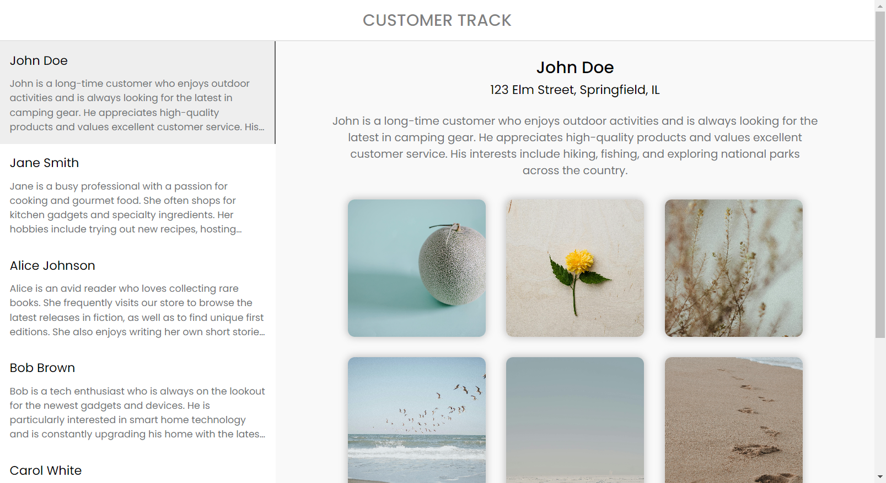
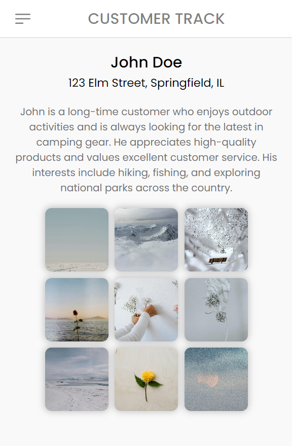
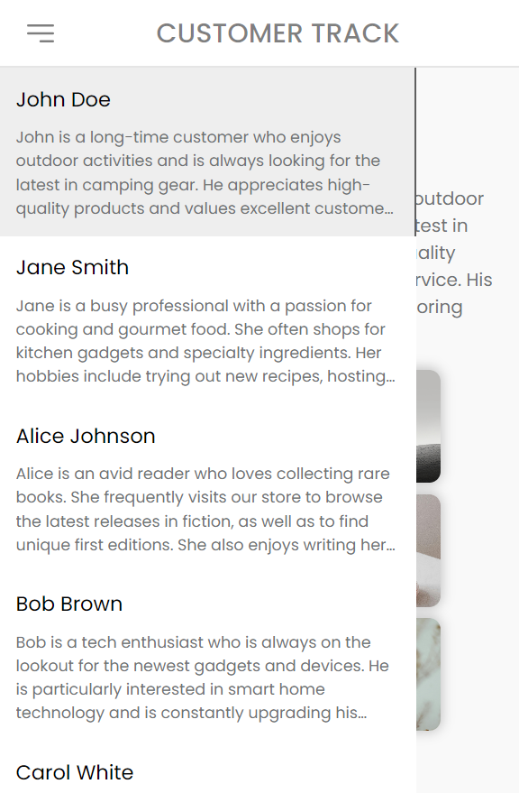

### Highlights
- Readable and Maintainable code
- Responsive design principles are applied
- Added Pagination to the navbar to load limited items (10) to enhance performance
- Created and used my own API to fetch images (free public API's have certain limitations)
- Created custom useFetch hook and used to fetch data
- Used React.memo to avoid unnecessary re-renders and imporove performance
- Avoided inline styling and functions to boost performance
- useCallback and useEffects are wisely used for better performance

## A sneak peek into what we have here!

Visit the website at: https://cube-pi-five.vercel.app/

### Home Page (Desktp view)



### Home Page - Navbar close (Mobile view)



### Home Page - Navbar open (Mobile view)




## Technology Stack

- **Coding Languages**:   

- **Tools & Frameworks**:    

- **Project Management Tools**:  

<hr>

## Environment Setup for local use-

- Drop a :star: on the GitHub repository.
  <br/>

- Download and install a code/ text editor. - Recommended- - [Download VS Code](https://code.visualstudio.com/download) 
  <br/>

- Download [Node Js and npm(Node package manager)](https://nodejs.org/en/) (when you install Node, npm also gets installed by default)
  <br/>


- Download and extract the github repository
<br/>

- Open the project (Cube Assignment-main) using VS Code
  <br/>

- Open a new terminal and enter `cd frontend` to navigate to the front end of the project
<br/>

- Run this command to install all dependencies for the frontend of this project.

```
npm install
```

<br/>

- Now run this command to start the project.

```
npm start
```
<br/>

- Now you are all set to use this project.

## Developer

- Md Riyaz Ahmed